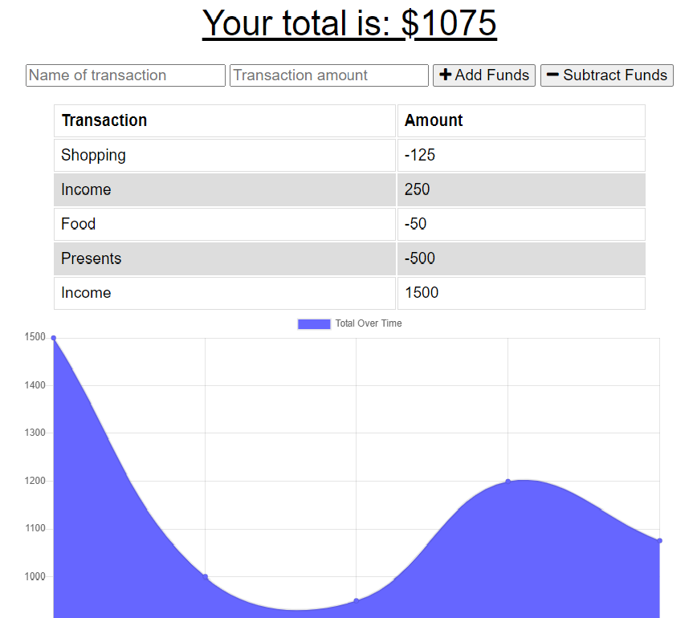

# Budget Tracker

## Description

This application will allow users to track their budger by adding or subtracting funds. The tracker is operational while offline, and will update and save new information once the application is back online.

## Requirements

- Users will receive an expense or deposit notification
- When users are offline, they will still be able to add expenses or deposits
- Once the application is back online it will update and add the expenses and deposits

## Screenshot

## Deployed Application

https://arcane-peak-75147.herokuapp.com/